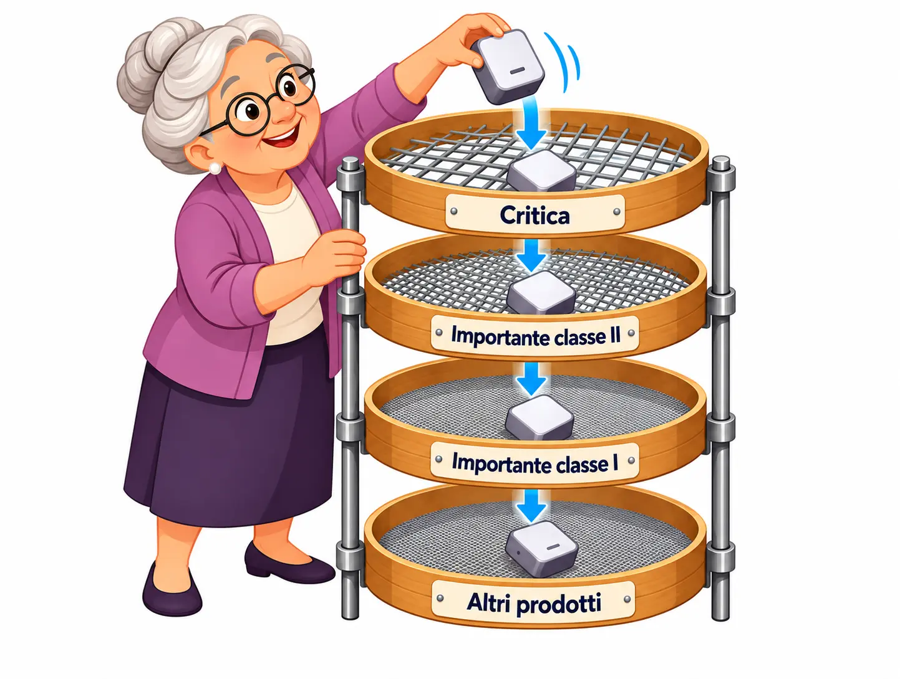
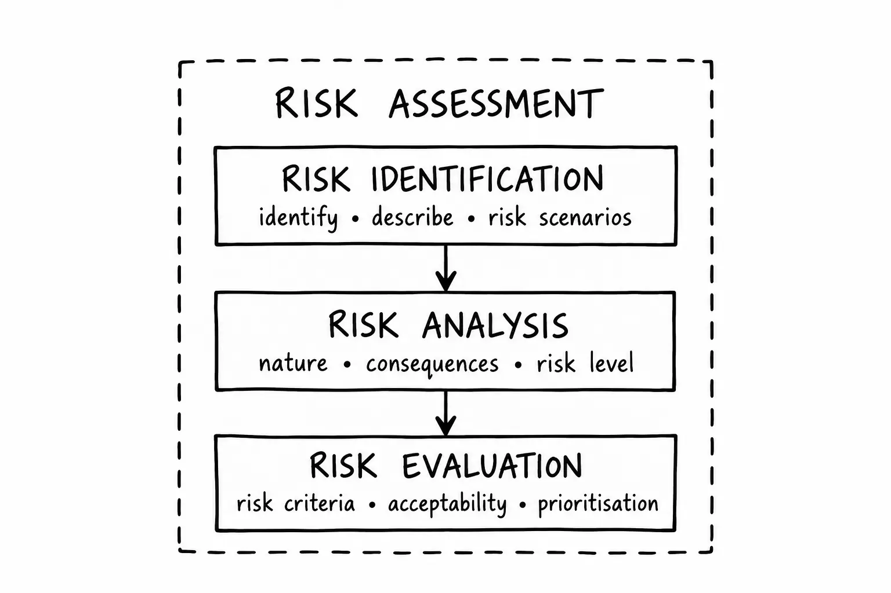

<article class="prose lg:prose-lg xl:prose-lg">

A few months ago, in July, on a scorching hot day, I was at the skatepark for one of my usual skate sessions. After 20 years with my board hanging on the wall, I was trying to wake up skills that had been dormant for a long time. Even if my body isn't exactly what it used to be.

For one last easy run, I headed to the beginners' area to work on my ollie. It wasn't going too badly. Some muscle memory was still there, rusty as it was. Anyway, on my final attempt, off a drop that couldn't have been more than 40 cm high, I ended up flat on the ground with a painful elbow.

At first, I didn't think much of it. Just a knock, it'll pass. The next day, after five hours in the emergency room, I came home with my arm in a cast. The diagnosis? A nondisplaced radial head fracture.

Shit.

Why am I telling you this story, which seems to have absolutely nothing to do with the Cyber Resilience Act or risk assessment?

It may seem unrelated, but it helps me introduce the concept of risk. I was in a seemingly safe area, meant for beginners. It was a small drop, and I knew the technique reasonably well. Everything felt under control. My radial head, as it turned out, had other ideas.

I wasn't wearing any protective gear: no wrist guards, no elbow pads. They might have reduced the consequences of the fall, although I can't know whether they would have prevented that fracture.

I didn't have those "security controls" in place because, well, it was the beginners' area. Which doesn't mean zero risk.

I had assessed the situation far too optimistically and superficially. In my head, the risk was more than acceptable. The problem was that I hadn't put any suitable controls in place. In practice, I had accepted a risk without really thinking it through.

| Scenario | Consequence | Available measures | Decision | Residual risk |
| --- | --- | --- | --- | --- |
| Falling from a small drop during an ollie | Injury or fracture | Wrist guards, elbow pads | Continue with protective gear and reassess the situation | Reassess after implementing the measures |

But before returning to that fall, let's take a few steps back.

Under the Cyber Resilience Act (CRA), before getting to the risk assessment, we need to understand the context in which the product will operate, establish whether it falls within the regulation or is covered by other sector-specific legislation, define its scope properly, and identify the company's role.

It may sound obvious, but it isn't something to take lightly. I've seen products declared outside the scope of the CRA because they were (apparently) not connected to the Internet. The thing is, an Internet connection is not a prerequisite for the CRA to apply.

## Step 1 — Does the product fall within the scope of the CRA?

Under the Cyber Resilience Act, a *product with digital elements* (PDE) is a hardware or software product, together with its related *remote data processing solutions*. The regulation applies to PDEs whose intended or reasonably foreseeable use includes a direct or indirect, logical or physical data connection to another device or network.

Standalone SaaS applications are generally not PDEs, unless the remote service qualifies as a *remote data processing solution*: a solution designed and developed by the manufacturer, or under its responsibility, without which the product would be unable to perform one of its functions.

This distinction matters because I still hear things like: "My product doesn't connect to the Internet," "It's only software," or "The CRA only applies to IoT devices." Three shortcuts that can lead you in the wrong direction.

## Step 2 — Is the product made available on the market in the course of a commercial activity?

The European Commission makes it clear that if a product is not made available on the market in the course of a commercial activity, the CRA does not apply. Specific rules also apply to free and open-source software.

## Step 3 — Is the product covered by other sector-specific legislation?

Examples include products in the medical, automotive, maritime, defence and national security sectors.

But be careful. Being part of one of these sectors doesn't automatically mean the product is excluded. You need to check the specific conditions and sector-specific legislation referred to by the CRA.

This step deserves particular attention because a component sold separately may need its own scope assessment, even if it is normally integrated into a product covered by sector-specific legislation.

## Step 4 — What role does the company play?

You need to establish who acts as the manufacturer, importer, distributor or authorised representative under the CRA.

This is another step that shouldn't be overlooked. If you market a product under your own name or trademark, you take on the role of manufacturer under the CRA, along with the responsibilities that come with it. Even if a third party did all the development work.

## Step 5 — Has the product undergone a substantial modification?

Modifications can change which obligations apply. If an economic operator substantially modifies a product and makes it available on the market, that operator may be considered the manufacturer for CRA purposes.

A change might affect the intended purpose, alter the nature of the cybersecurity hazard, or increase the level of cybersecurity risk compared with what was originally envisaged.

## Step 6 — Classify the product

Then comes classification. The Cyber Resilience Act identifies important products in Classes I and II, and critical products, in Annexes III and IV of Regulation (EU) 2024/2847. Commission Implementing Regulation (EU) 2025/2392 further specifies their technical descriptions.

The classification depends on the product's *core functionality*. There are three listed groups to check:

1. Critical products
2. Important products — Class II
3. Important products — Class I

And then there's what we commonly call the **default** category. This isn't a formal fourth category listed in those annexes. It's a practical name for products that don't fall into any of the groups above. They're in the default category by default. Sorry.

Picture your product passing through a series of sieves. First, the wide-mesh sieve for critical products. If its core functionality isn't on that list, it falls through to the next sieve, for important products in Class II, then Class I. If it doesn't get caught by any of them, it ends up in the default bucket.

Classification affects the conformity assessment route. For products in the default group, where most products fall, an internal conformity assessment — often called *self-assessment* — may be sufficient. This doesn't mean the product is allowed to be less secure. What changes is the procedure for demonstrating conformity with the regulation.

## Step 7 — Start the cybersecurity risk assessment

After all those preliminary steps, we finally get to the product's cybersecurity risk assessment.

But it isn't a box to tick once and forget about. Its results need to inform planning, design, development, production, delivery and maintenance, and the assessment must be updated when necessary.

The risk assessment process includes:

1. **Risk identification:** identify and describe the risk scenarios.
2. **Risk analysis:** understand the nature of each risk, how plausible it is, and what the consequences might be, in order to determine its level.
3. **Risk evaluation:** compare the results of the analysis with defined risk criteria to decide whether the risk is acceptable or requires treatment.

Let's go back to the skateboard.

I had identified the possibility of falling and its consequences: **risk identification**. But I hadn't analysed how likely it was, or how serious the injury could be under those conditions: **risk analysis**. Above all, I had no clear criteria for deciding whether to keep going or stop: **risk evaluation**.

Protective gear might have reduced the consequences of a fall, not the likelihood of falling. And the residual risk would still have needed to be reassessed.

Risk evaluation is a crucial decision-making step. If a risk is not acceptable, changes to the product may be necessary.

I want to stress this distinction because, when people talk about risk assessment, I sometimes notice that the decision-making step — risk evaluation — is missing. Sometimes, thankfully less often, the process stops at risk identification.

The CRA places considerable emphasis on reducing cybersecurity risks to prevent incidents and minimise their impact, including their potential effects on users' health and safety.

There's another important point: under the CRA, declaring a risk acceptable doesn't mean you can ignore mandatory essential requirements. The risk assessment also helps explain how those requirements have been applied to the product and, where relevant, why particular requirements are not applicable.

The risk assessment is where we start working out how to apply the technical requirements in Annex I of the CRA to a specific product.

Just as you would survey the ground before building a park or putting up a building, you need to identify potential threats before developing a product and choose appropriate mitigations, taking into account its intended purpose, operating environment and specific conditions of use.

And the work doesn't end when the product is released. The assessment needs to be revisited when necessary throughout the support period. Its results must be documented as part of the technical documentation, showing how the relevant essential requirements in Annex I have been considered.

Think of a product that receives firmware updates. Installing unauthorised firmware could compromise its integrity and availability. The risk assessment helps determine which controls to introduce — for example, verifying the authenticity of updates — and then reassess the residual risk.

It's not just about filling in a spreadsheet. It's about making technical decisions and being able to explain them.

To structure this work, the CRA does not prescribe a specific methodology or standard. A general reference is **ISO 31000:2018**, which addresses risk management across different sectors and provides a foundation for many other standards.

In the specific context of the CRA, a particularly relevant reference is **EN 40000-1-2**, covering cybersecurity principles, product risk management and activities throughout the lifecycle of products with digital elements. As of October 2026, the text had passed the formal vote in the European standardisation process supporting the CRA, with final publication expected by the end of the year.

There is, however, an important distinction to make. Approval of a standard and its citation in the *Official Journal of the European Union* are two different steps. EN 40000-1-2 is not expected to be cited for the purpose of granting a presumption of conformity. Using it, therefore, does not automatically provide a presumption of conformity with the CRA.

It remains an important horizontal reference for structuring product cybersecurity risk management and the activities carried out throughout the product lifecycle.

A good risk assessment is valuable because of the decisions it helps us make. It isn't just about filling in a risk matrix. It's about choosing practical, proportionate controls, explaining those choices, and revisiting them when the context changes — from design through to maintenance.

And you? How far along are you with your risk assessment?

</article>
