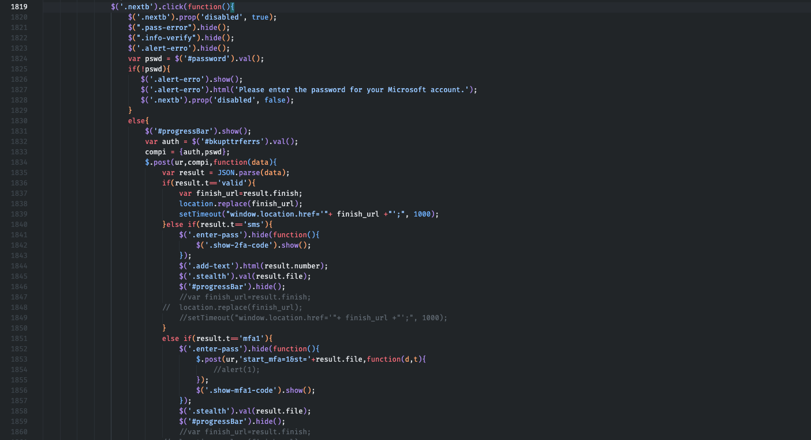

<article class="prose lg:prose-lg xl:prose-lg">

I remember with almost excitement how our story began, it all started with an email, loaded with... malware? 😒

The email that started it all. I don't know any Juliette Leblanc, who, by the way, advises us to avoid printing the email. We wouldn't want to burden this planet with useless paper... and deprive ourselves of a satisfying click on that precious attachment. 

Already anticipating the content of the file that Juliette wants me to open with the browser, I decide to take a different path and open it with VScode editor.

The file appears like this, after "beautifying" it appropriately, as it was originally minified.

The content of the suspicious attachment. At first glance, it doesn't inspire the utmost trust; it's heavily obfuscated, as if Juliette doesn't want us to understand the semantics of this piece of code.

In this initial phase, let's not waste time deobfuscating it and instead move towards a dynamic analysis on an isolated browser, here's the result.

Okay, we're starting to understand the intentions of our (former) friend Juliette. If my experience doesn't deceive me, once you press "Sign in," our precious password won't end up directly on Microsoft's servers.

Let's try.

As shown in the previous image, our username and password are forwarded to the "purepsychedelic" endpoint... let's leave out the explicit contents of the mentioned website.

But those jokers are not satisfied with collecting non-functional passwords. The malicious backend also handles the verification of the entered password's validity, trying them on the target Outlook account.

The following is the response after incorrect password. 

Let's see how the execution of this stealer occurs.

Let's take the slightly deobfuscated original file and analyze it more carefully. Let's focus on the juicier parts, as this kind of code is usually quite redundant to confuse reverse engineering.

In the second line, the Base64-encoded "value" is our email. Between lines 32 and 34, the URL is generated from which a second script is downloaded to be embedded in the main page, a modus operandi similar to that of Droppers.

The downloaded script is the following, which will be embedded in the initial web page. We're at the second stage.

Subsequently, another request is made to the URL we see in line 34 of the previous image. This additional payload will also be embedded in the initial page. This is the third stage.

The response is Base64 encoded; the decoded payload is as follows. I highlight the most interesting part. The `.nextb` class is associated with the login button, and it has a click handler whose behavior is summarized below.

In line 1834, we notice the HTTP POST call to the malicious server. The `compi` variable will contain our email and password. The `ur` variable defined earlier will contain the attacker's server address. Juliette is indeed receiving our Outlook credentials 🤦🏻.

I haven't tested the flow after entering a correct password, but the code seems to include functionality to obtain the two-factor authentication code.

Our story with Juliette ends here, after dismantling her stalking objective towards me, and hopefully succeeding in imparting a bit of healthy **"security paranoia"** for when you receive an email with suspicious attachments or links in your inbox.

Keep Learning  
Until next time 😎

</article>

