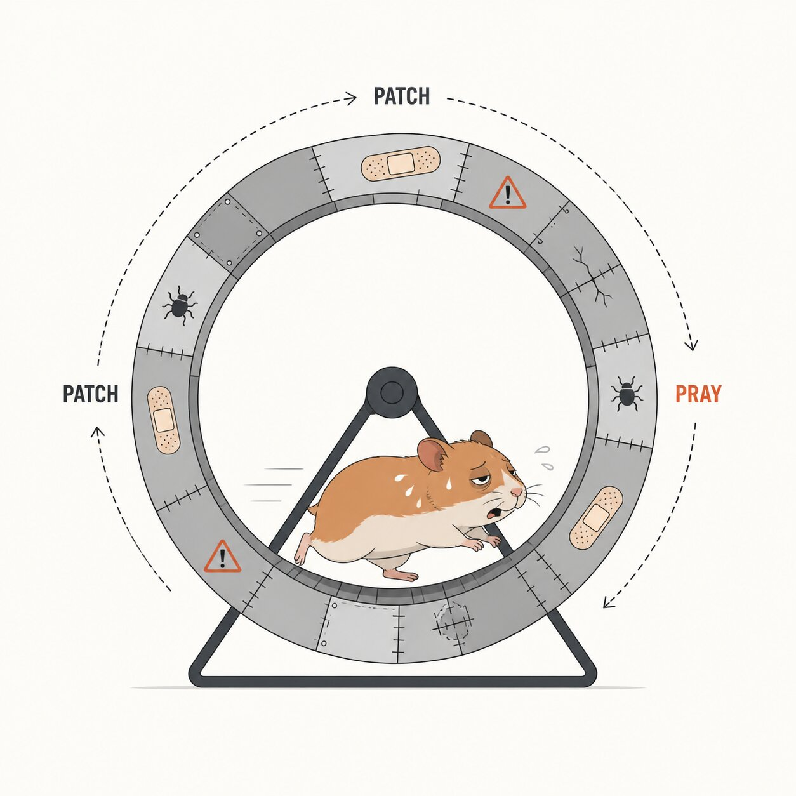

<article class="prose lg:prose-lg xl:prose-lg">

# Secure by Design: Escaping the Hamster Wheel of Pain

This week, a member of my team showed me, slightly disappointed, a vulnerability he had identified in a piece of software he was testing.

Disappointed because, in 2026, with LLMs that, if guided properly, can identify patterns that may lead to vulnerabilities, he did not expect to find a classic **second-order SQL injection**, caused by completely unsanitized input.

And yet, here we are.

Why do we keep making these kinds of mistakes?

Why do we keep building software that exposes the same problems we were talking about twenty years ago, only now with nicer interfaces, distributed microservices, noisier pipelines and, of course, an LLM squeezed somewhere into the process?

This is not just a story about a second-order SQL injection.

It is a story about **Secure by Design**, **Secure by Default**, **developer-centric security** and why many organizations are still trapped in the old **penetrate-and-patch** model.

The short answer is: because we still treat security as a phase, a control, a ticket, a penetration test, a checklist to close before release.

The more uncomfortable answer is: because, too often, we do not design secure software.

We patch it later.

---

## 🤔 Who this article is for

This article is especially for software developers, product security teams, engineering managers and companies that appreciate software built well, with robust foundations.

It is also for anyone tired of seeing the same classes of vulnerabilities come back every year, dressed up in slightly different clothes.

---

## 🧭 What you’ll find in this post

- The pillars of computer security, from Saltzer and Schroeder
- Why “penetrate and patch” is not enough
- What Secure by Design actually means
- Why security must be usable for developers and users
- The “dancing pigs” problem
- Why Secure by Default matters
- Practical takeaways to escape the hamster wheel of pain

---

## The Hamster Wheel of Pain: Patch and Pray in Cybersecurity

Borrowing an analogy from the book *A Vulnerable System: The History of Information Security in the Computer Age*, the **Hamster Wheel of Pain** is the perfect representation of companies that prefer a reactive approach to cybersecurity.

They get trapped in a cycle of **patch and pray**: after a penetration test, they apply the necessary fixes, often, despite the recommendations, without paying too much attention to the systemic risk behind the vulnerabilities that were identified.

Then they pray that no more will be found.

This approach, also known as **penetrate and patch**, unfortunately addresses only the symptoms and never the root causes of insecure software.

Like the classic antibiotic that most general practitioners prescribe regardless of the actual cause.

Whatever. It works, right?

This way of doing things gives me hives.

And I understand very well, having developed software for more than ten years, the constraints that exist behind the scenes: speed, commercial pressure, shifting priorities, product owners who want “just this one small feature”, arbitrary deadlines, and an obesity of features that keeps growing sprint after sprint.

All of this while nobody worries too much about technical debt, which in the meantime increases the complexity of the software flowing from developers’ fingers or from the LLM of the day.

A vicious cycle that makes bugs and vulnerabilities much easier to introduce.

---

## Technical Debt Is Security Debt

What happens while software is drowning in technical debt?

What happens is that, when the attacker of the day finds a vulnerability in the code, the fix may be hard to apply.

In the worst cases, as happened to me during my experience with systems made of dozens and dozens of microservices, applying a meaningful fix may even be impossible without a redesign.

And while you are trying to understand who owns that service, which team wrote that component, why that database is queried from three different paths and which pipeline breaks everything if you touch one dependency, the attacker does not exactly have the same organizational problems.

The attacker, now accelerated and empowered by AI, has all the time in the world to smash the famous **CIA triad** with a hammer: confidentiality, integrity and availability.

We, on the other hand, often have Jira, Slack, ten meetings and a backlog that looks like the final boss.

Technical debt is not only an engineering problem.

It is also a security problem.

Because code that is hard to understand is hard to protect.

Code that is hard to modify is hard to fix.

And code that is hard to fix becomes a gift for whoever finds the vulnerability first.

---

## Saltzer and Schroeder’s Security Principles: Still Relevant in 2026

The paper by **Jerome H. Saltzer and Michael D. Schroeder**, *The Protection of Information in Computer Systems*, published in 1975, is one of the foundational texts of computer security.

It explains how to design secure computer systems from the architecture up, instead of adding security later as a “patch”.

The central point is that information protection does not depend only on passwords or technical controls, but on design principles: reducing complexity, granting only the privileges that are needed, checking every access, avoiding secret mechanisms as the only line of defense, separating powers and making security understandable for users.

I know very well that most companies deliberately decide to ignore these principles, but I want to fool myself into believing that this happens only because they do not know them.

So here you go, enjoy the list.

---

### Economy of mechanism

The design should be as simple and small as possible.

A complex system is harder to inspect, harder to understand and more likely to contain implementation errors that nobody noticed.

Translated into 2026: if, to understand the authorization flow of a feature, I need to open twelve repositories, three dashboards, two Confluence pages and a diagram last updated when dinosaurs roamed the Earth, maybe the problem is not just “a missing check”.

---

### Fail-safe defaults

Access decisions should be based on explicit permission, not on exclusion.

The default state should be no access. This way, a design error appears as a denial, which is easier to spot, and not as unauthorized access.

If I do not know what to do, I deny.

If I do not understand the input, I reject it.

If I do not have an explicit rule, I do not improvise.

It is simple.

Exactly why it is often ignored.

---

### Complete mediation

Every request to access every object must be checked against the current authority.

The system should not rely on “remembered” past checks, because if the authority changes, the result may no longer reflect the current state.

This principle is also fundamental when we talk about **input validation**: every piece of incoming data must be verified before being used, because input is a boundary between what the system controls and what it does not control.

The fact that a value comes from an authenticated user, an internal component, a queue, a webhook or another microservice does not magically make it trustworthy.

Implicit trust is a shortcut.

And shortcuts, in security, often end up in a penetration test report.

---

### Open design

The design should not be secret.

Security should rely on the possession of specific keys, credentials or secrets, not on the attacker’s ignorance of how the internal mechanisms work.

This does not mean publishing everything on GitHub with a note saying “please don’t abuse this”.

It means that the system should remain secure even if someone understands how it works.

If the security of your product depends on nobody discovering an endpoint, a hidden parameter, an internal logic or a predictable name, you do not have a security control.

You have a hope.

---

### Separation of privilege

Where possible, a protection mechanism should require more than one independent condition to authorize an action.

No single accident, abuse of trust or mistake should be enough to compromise the information.

In the modern world, this means, for example, not trusting everything to a single token, a single role, a single frontend-side check or one automatic approval.

Robust security also comes from composing independent controls.

---

### Least privilege

Every part of the system, including users, services, jobs, containers, serverless functions and integrations, should operate using the minimum set of privileges needed to complete its task.

This limits the damage in case of error or compromise.

It is one of the most quoted and least respected principles in the history of computing.

Because, in the end, “just give it admin so we don’t block the release” is a sentence that has done more damage than many CVEs.

---

### Least common mechanism

The number of mechanisms shared by multiple users or components should be minimized.

Every shared mechanism is a potential unauthorized communication channel, a coupling point, an attack surface or a single point of failure.

In modern software, this principle speaks directly to shared queues, global caches, multi-tenant storage, common services, internal libraries and centralized platforms.

Shared things are convenient.

They are also perfect places to hide very creative bugs.

---

### Psychological acceptability

The human interface should be designed for ease of use, so that users apply protection mechanisms automatically and correctly.

Security should match the user’s mental model, reducing the chance of mistakes.

This principle is often interpreted as “let’s make the UI pretty”.

No.

The point is much deeper: if a security control is hard to understand, hard to use or too far from the way people actually work, that control will be bypassed.

And this applies to final users, but also to developers, DevOps, product teams and anyone who has to use security tools or functionalities in their daily work.

The paper also highlights that focusing only on technical mechanisms, such as protection and authentication, gives a dangerously narrow view.

A secure system must take the human factor into account: if the mechanisms are too complex or too rigid, users will find ways to work around them, canceling the effectiveness of even the most sophisticated design.

This also applies to the design of libraries and SDKs.

If I need to run a SQL query or spit out HTML output, I want sanitization, parameterization and encoding to be built in.

I do not want to remember the correct magic formula every time.

I do not want the secure path to be more painful than the insecure one.

I do not want security to depend on how mentally fresh I am at 17:47 PM on a Friday.

Because nobody is mentally fresh at 17:47 PM on a Friday.

---

## What Secure by Design Actually Means

**Secure by Design** means that security is not added at the end of the software development lifecycle.

It is considered from the beginning and continuously revisited across the software lifecycle: requirements, architecture, implementation, testing, deployment, maintenance and decommissioning.

Threat modeling is not “a phase”.

It is not a workshop you run once, produce a diagram, attach it to a ticket and then forget in some folder nobody will ever open again.

It is a way of asking, repeatedly and at the right moments, uncomfortable questions:

- Who can abuse this feature?
- Where are the trust boundaries?
- What happens if this input is malicious?
- What privileges does this service really need?
- What is the safest default behavior?
- What happens when this component fails?
- What evidence do we have that this control actually works?

In short: Secure by Design is not a security activity.

It is an engineering discipline.

And this is where the conversation usually becomes less comfortable, because Secure by Design is not something you can sprinkle on top of a product two weeks before release.

It is not a scanner.

It is not a pentest.

It is not a badge.

It is a way of building software where security decisions are made when they are still cheap enough to make.

Before the architecture becomes concrete.

Before the database schema becomes a fossil.

Before the authentication flow is copied into six services.

Before the insecure shortcut becomes “legacy behavior”.

---

## Secure by Design and Secure by Default, but for Real

In recent years, we have been hearing more and more about **Secure by Design** and **Secure by Default**.

Beautiful concepts.

At least until they become marketing slogans.

Secure by Design means designing security from the beginning: architecture, requirements, technology choices, privilege management, error handling, logging, supply chain, updates, configurations and product lifecycle.

Secure by Default means that the product should start from a reasonably secure configuration.

It should not be the user’s job to discover that they need to disable a dangerous feature, manually enable TLS, change a default password, restrict an overly permissive role or read twenty-seven pages of documentation just to avoid exposing everything to the Internet.

A Secure by Default product does not ask the user to earn security.

It gives it to them as the starting point.

And this applies to developers too.

If a library makes it easy to build SQL queries by concatenating strings, but requires more work to use parameterized queries, we have already lost.

If a framework makes it easier to print non-encoded output than to use proper contextual encoding, we have already lost.

If an SDK allows the use of overly privileged tokens without friction, we have already lost.

If the insecure way is the fastest way, someone will use it.

Maybe not today.

Maybe not the senior developer who has just attended an OWASP training.

But sooner or later, someone will.

And when it happens, it will not be only their fault.

It will also be a design failure.

---

## The Dancing Pigs Problem: Why Users Bypass Security

So what happens if implementing a feature securely, or using a product securely, is too complex?

What happens is that the final user decides to bypass the secure implementation or the secure usage, because the time spent using it securely is perceived as a cost higher than the benefit.

Security stops being a support and becomes friction.

A pebble in the shoe.

Something to avoid, bypass or disable just to complete the task.

This is the **dancing pigs** problem: if the user wants to see dancing pigs and the system puts an incomprehensible warning in front of them, very often the user will click anyway.

Not because the user is stupid.

But because, in that moment, their goal is not “maintaining an adequate security posture”.

Their goal is to see the dancing pigs, complete a task, send a file, release a feature, close a ticket, make a pipeline run, deliver something.

Security loses when it asks the user to interrupt their flow without offering a simple alternative.

It is the same principle behind **Developer-Centric Security**: security must adapt to the way developers work, not force them out of their flow.

If the secure path is slower, confusing or punitive, it will be avoided.

If instead it is integrated, understandable and automated, it becomes a natural part of the development process.

And the same applies to finished products and user experience.

The secure product is not the one that shows more warnings.

It is the one that makes doing the wrong thing difficult and doing the right thing natural.

---

## Security Should Not Require Heroism

One of the biggest mistakes we make is designing processes that require heroic behavior.

We expect developers to know every vulnerability class, every edge case, every secure configuration, every cryptographic implication, every supply chain risk, every possible flaw in input validation.

Then we put them under pressure, ask them to deliver quickly, change priorities every week, add dependencies, expand the perimeter, insert AI-generated automations and act surprised when something goes wrong.

Security cannot depend on individual heroism.

It must depend on systems, libraries, architectures, guardrails and defaults that make secure behavior the easiest behavior.

This does not remove developers’ responsibility, of course.

But it changes the question.

Not anymore:

> Why didn’t the developer sanitize that input?

But:

> Why did our stack make it possible, or even easy, to use that input dangerously?

Not anymore:

> Why didn’t the team follow the checklist?

But:

> Why was the checklist outside the workflow?

Not anymore:

> Why didn’t anyone find this vulnerability before the pentest?

But:

> Why did our process allow this class of bug to reach the pentest?

These questions are much more annoying.

And precisely for that reason, they are much more useful.

---

## Practical Takeaways for Secure Software Development

If we want to get out of the Hamster Wheel of Pain, we need to stop thinking about security as a repair activity and start treating it as a property of the system.

A few practical takeaways, without pretending to fix the world with a bullet list:

- **Make the secure path the easiest path.**  
  If doing the secure thing requires more steps, more knowledge or more effort, it will be avoided.

- **Use secure defaults.**  
  Deny by default, enable only what is needed, reduce privileges, disable risky features when they are not necessary.

- **Integrate security into the developer workflow.**  
  Fast feedback, tools in the pipeline, automatic checks, clear suggestions and actionable fixes. Not 48-page PDFs attached at the end of the project.

- **Design libraries and SDKs that are hard to misuse.**  
  Parameterized queries, contextual output encoding, centralized validation, secure secret management and APIs that do not encourage dangerous shortcuts.

- **Reduce complexity.**  
  Every layer, every microservice, every dependency and every exception to the flow increases the attack surface and makes it harder to understand what is happening.

- **Treat technical debt as security debt.**  
  Code that is hard to change is code that is hard to fix when it matters. And when it matters, it is often already too late.

- **Do not wait for the penetration test to discover architectural problems.**  
  A pentest is useful, but it should not be the first moment someone asks: “was this thing designed securely?”

- **Automate where it makes sense, but do not delegate judgment.**  
  LLMs, SAST, DAST, SCA and all the various scanners are useful tools. But they do not replace architecture, continuous threat modeling and good design.

- **Measure recurring vulnerability classes.**  
  If every quarter you keep finding SQL injection, XSS, IDOR or authorization issues, the problem is not the single bug. It is the system that keeps producing them.

- **Stop rewarding only speed.**  
  If the only real metric is “ship it”, we should not be surprised when everything that does not look immediately functional gets cut.

---

## Conclusion

The second-order SQL injection found by my colleague is not interesting because it is technically exotic.

It is interesting because it is banal.

And that is exactly the point.

In 2026, we should not be surprised that an LLM can identify vulnerable patterns.

We should be surprised that those patterns are still so easy to introduce.

The problem is not only the absence of a control.

The problem is an ecosystem that still makes insecure code too easy to write, doing the right thing too painful, and acting only after someone finds the hole too normal.

The Hamster Wheel of Pain is not broken by applying yet another patch.

It is broken by designing systems where certain vulnerabilities become hard to introduce, easy to detect and inconvenient to ignore.

Saltzer and Schroeder were already saying this in 1975.

We, just to be safe, keep running inside the wheel.

At least the hamster, poor thing, does not have Jira.

---

### 📚 References
[ Tom Regan, *Putting the Dancing Pigs in Their Cyber-Pen*, 1999](https://www.csmonitor.com/1999/1007/p18s2.html)

[Jerome H. Saltzer, Michael D. Schroeder, *The Protection of Information in Computer Systems*, 1975](https://www.cs.virginia.edu/~evans/cs551/saltzer/)

[Andrew J. Stewart, *A Vulnerable System: The History of Information Security in the Computer Age*](https://www.jstor.org/stable/10.7591/j.ctv1bxh5t3)

[ENISA, *Secure by Design and Default Playbook*](https://www.enisa.europa.eu/sites/default/files/2026-03/ENISA_Secure_By_Design_and_Default_Playbook_v0.4_draft_for_consultation.pdf)

## 👋 Let’s Connect

If you found this post helpful, or if you want to chat more about this or anything at the intersection of development and security — I’d love to hear from you.

Feel free to reach out on <a href="https://www.linkedin.com/in/riccardosirigu/" target="_blank" rel="noopener noreferrer">LinkedIn</a>

Always happy to connect with fellow developers, researchers, and security-minded folks.

Stay curious. Stay secure. 🔒🚀